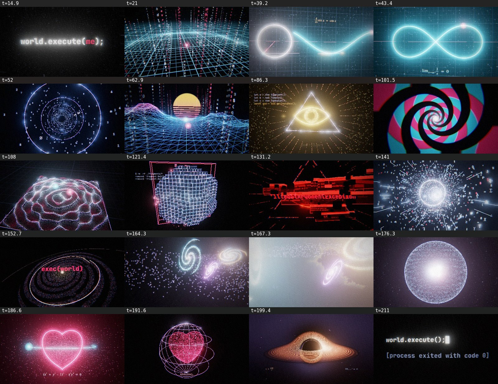

# world.execute(me); — 3D MV

为 Mili 的《world.execute(me);》制作的实时 3D 音乐视频（粉丝作品）。整部 MV 用 three.js 在浏览器里逐帧实时渲染，并与歌曲的 130 BPM 节拍和每一句的时间点精确对齐。前半段是终端、几何、模拟世界；到后面越来越震撼：代码虫洞 → execution 连击 → 宇宙大爆炸 → 由代码构成的宇宙和漂浮在太空中的物理公式 → 爱心的代数方程 → 黑洞，最后回到 `world.execute(me);`。

*A real-time three.js music video for Mili's "world.execute(me);". It is beat-synced to the song's 130 BPM grid and to every sung line. Toward the end it escalates: a code wormhole, the "execution" chant, a big bang, a universe made of code with physics equations floating in space, the algebraic heart curve, and a ray-marched black hole. The song and lyrics are **not** included; you supply your own copy.*



## 怎么看

1. `npm install && npm run build`，然后用浏览器打开 `dist/index.html`（也可以直接打开 `docs/index.html`，这是构建好的同一个文件）。
2. 点 **♪ choose song…** 选择你自己的歌曲文件（专辑版，3:32；mp3/flac/m4a 都行，文件只在本地读取），然后 **▶ PLAY**。也可以把音频文件直接拖进页面。
3. 可选：加载 `.lrc` 歌词文件，歌词会以终端打字的样式显示在画面下方。
4. 没有歌也可以点 **watch without audio** 先看画面。

如果开启 GitHub Pages（Settings → Pages → Branch `main` / 文件夹 `/docs`），`docs/index.html` 就是一个可以直接分享的网页。

| 按键 | 作用 |
|---|---|
| `space` | 播放 / 暂停 |
| `←` `→` | 后退 / 前进 5 秒 |
| `0`–`9`（`shift` +10） | 跳到第 N 章 |
| `[` `]` | 微调音画同步（±50 ms） |
| `h` / `l` / `f` | 隐藏 HUD / 隐藏歌词 / 全屏 |

网址参数：`?t=150` 从 150 秒开始，`?maxw=1280` 限制渲染宽度（显卡较弱时用）。

### 音画同步

- 时间轴基于专辑版（212.3 秒）。加载歌曲时会自动检测开头的静音（有些音源前面多出一段空白），并在 ±110 ms 内把节拍网格对齐到检测到的鼓点。
- 如果你的版本有偏差，用 `[` `]` 微调；渲染时用 `--offset=秒`。

## 导出 MP4

需要 Node.js 18+、Chrome/Chromium、ffmpeg。

```bash
npm install
node tools/render.mjs --frames=0:212.3 --workers=4 --audio=path/to/song.mp3 --gpu   # 渲染所有帧到 out/frames（可断点续渲）
node tools/render.mjs --encode --audio=path/to/song.mp3                          # 合成 out/world.execute(me).mp4
```

- `--audio` 让画面对这首歌做律动分析（低频、鼓点），并在最后混入音轨；`--lrc=歌词.lrc` 把歌词烧进画面；`--nohud` 去掉角落的时间码。
- `--gpu` 使用显卡；不加时用 SwiftShader 软件渲染（服务器上也能跑，但慢，960×540 约 0.8 秒/帧/进程）。
- `--w=1920 --fps=30` 是默认输出规格；`--chrome=<路径>` 指定浏览器。
- 编码时 `--crf=18`（默认，越大文件越小）和 `--maxrate=4M` 控制文件大小；画面有胶片颗粒，高画质时码率会比较高。
- 快速检查：`--sheet=20,60,161.5 --cols=3 --w=640` 生成缩略图拼版，`--clip=150:165` 渲染一小段。

## 分镜

| 时间 | 章节 | 画面 |
|---|---|---|
| 0:00 | BOOT | 黑屏终端逐行开机、加载参数、创建世界，标题 `world.execute(me);`，塌缩成一个红点 |
| 0:16 | GENESIS | 红点展开霓虹网格，代码柱像城市一样生长，每小节一圈波纹 |
| 0:29 | GEOMETRY | 点 → 三维坐标轴；半径画圆，π 的数字环绕；圆展开成正弦波，切线滑动；正弦折成 ∞，镜头冲进去 |
| 0:44 | CURRENT | 示波器上的交流 / 直流与闪电；眩晕的螺旋；穿越年份的时间隧道；红点与青点螺旋相遇 |
| 0:58 | SIMULATION | 合成波风格的线框世界俯冲飞行；拉远：世界被封在一个立方体里，而它只是无数个立方体之一 |
| 1:13 | NEW OBJECT() | 两万多个点依次组成茄子、番茄、虎斑猫，最后是"上帝之眼"和 `you ⊢ ∃ me` |
| 1:28 | SWITCH | 翻牌显示屏翻转状态，时钟从 AM 转到 PM，最后坠入催眠螺旋 |
| 1:43 | VIBRATION | 克拉尼板：沙粒聚集在振动的节线上；"离开"的六次卡顿跳切，青点越跳越远，只剩红点孤零零 |
| 1:58 | ERASE | 体素世界被一块块删除；红色的眼睛睁开，报错窗口成倍堆叠，`IllegalArgumentException`，屏幕碎裂 |
| 2:14 | OVERFLOW | 代码隧道，速度不断加快，递归深度指数爆炸到 ∞，最后两小节频闪 |
| 2:27 | EXECUTION | 由代码组成的旋涡星系，12 次 execution 每次都有冲击波和换机位；1–6 倒数（附二进制），星系内爆 |
| 2:41 | UNIVERSE | 大爆炸，星系从爆炸中凝结；穿越宇宙时欧拉公式、薛定谔方程、爱因斯坦场方程、麦克斯韦方程等依次掠过，还有洛伦兹吸引子和曼德博集合；拉远：整个宇宙在一个代码球壳里 |
| 2:57 | LOVE | 公式旋风、问号与"∴"；`(x²+y²−1)³ − x²y³ = 0` 画出心形，填充成跳动的 3D 心脏；青点自由飞走，笼子把心锁住 |
| 3:13 | SINGULARITY | 光线步进的黑洞与引力透镜，吸积盘由环绕下落的代码构成；镜头盘旋坠入视界 |
| 3:25 | EXIT | 白屏 → 终端 `world.execute(me);`，"me"被删掉，`[process exited with code 0]` |

## 结构

```
src/
  main.js            播放器、逐帧渲染入口、转场
  timeline.js        段落和每句的时间点（只有时间，没有歌词）、节拍网格
  hud.js lyrics.js   角落 HUD、用户提供的 LRC 歌词
  engine/            后期（泛光 / 色散 / 故障 / 转场）、音频分析、文字与公式排版、粒子等
  scenes/            15 个章节，每章一个文件，画面只取决于时间 t
tools/build.mjs      打包成单个自包含 HTML
tools/render.mjs     无头 Chrome 逐帧渲染 + ffmpeg 编码
```

每一帧只由时间决定（不依赖上一帧），所以可以任意跳转，也可以多进程并行渲染。

## 版权

- 歌曲《world.execute(me);》及歌词版权属于 Mili。本仓库不包含音频和歌词，只包含公开的段落时间点。
- 字体：JetBrains Mono、STIX Two（均为 SIL OFL）。引擎：three.js（MIT）。
- 渲染流程参考了 [PDoomVideo](https://github.com/JohnHeibel/PDoomVideo) 的无头逐帧渲染思路。
